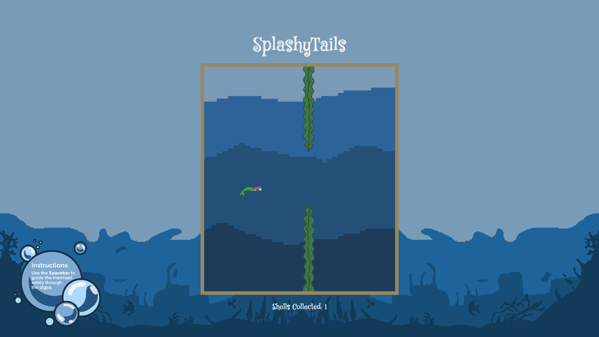

# 🎮 **Game Title** 

Collect as many shiny shells as possible for your mom’s dinner—but watch out! The moving algae create tricky gaps that you’ll need to skillfully swim through. One wrong move, and you’ll get caught!

## Comic/Story

  
  
The Comic from the start screen

## GamePlay

  
  
Gameplay Screenshot

## Mermaid

  
  
Mermaid Spritesheet

## Shell

  
  
The Comic from the Startscreen

## Challenges:
   -Object-Oriented Programming (OOP) Struggles: Understanding and properly applying OOP concepts, such as classes and inheritance, was difficult. Structuring the code efficiently took more time than expected.
    
  -Physics Tweaks: Fine-tuning gravity, jump force, and collision detection to make the game feel natural was trickier than anticipated.
  
  -Game Loop Issues: Ensuring a consistent frame rate and properly resetting the game after a loss presented some challenges.
   

## Lessons Learned:

  -OOP Practice is Key: Breaking down the game into manageable classes helped, but I need more experience with structuring code efficiently.
  
  -Debugging Strategies Matter: Learning to debug collision issues and refine movement physics was valuable for future projects.
  
  -Start Simple: Beginning with a minimal working version and gradually adding features made the development process more manageable.

